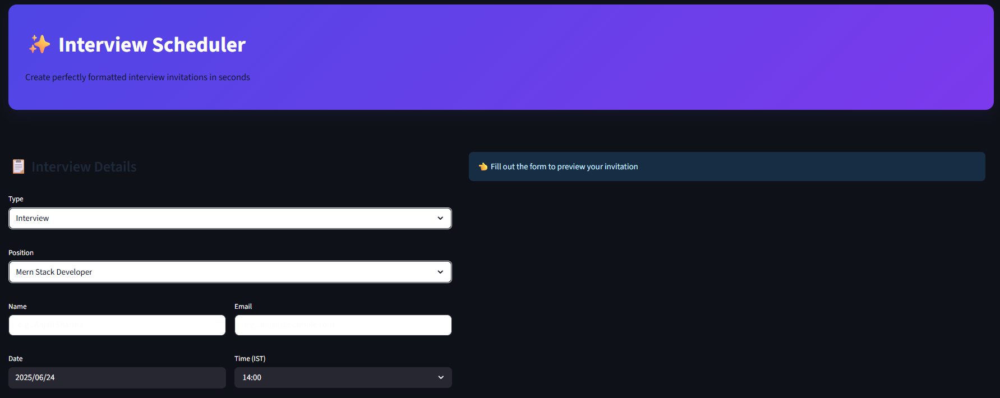
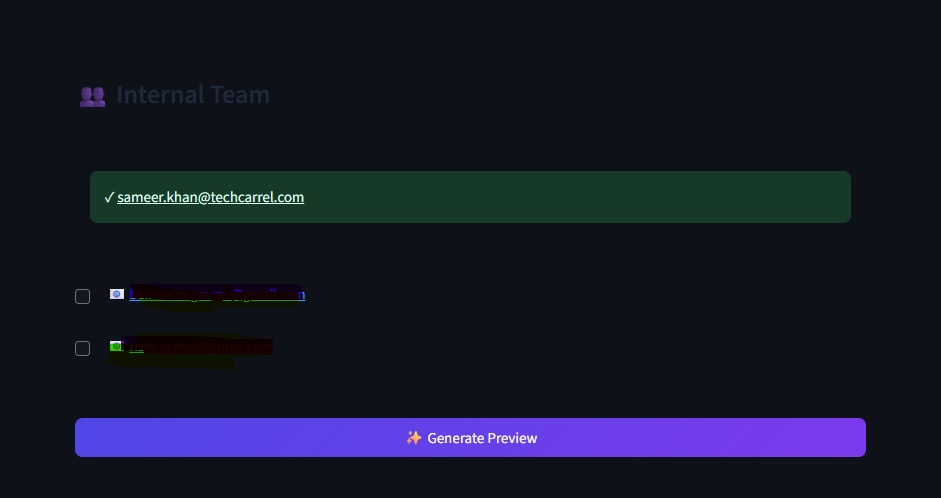

# ✨ AI-Powered Interview Scheduler

This is a premium, high-efficiency web application built with Python and Streamlit to automate the creation of professional job interview invitations. It replaces manual copy-pasting with a sleek, form-based interface that uses AI to compose perfectly formatted event details, which are then scheduled directly via the Google Calendar API.

The application is designed for a fast and error-free workflow, allowing an HR professional to generate and send a complete, templated interview invitation in seconds.

<table align="center">
  <tr>
    <td align="center">
      <p><strong>Main Interface</strong></p>
      
    </td>
    <td align="center">
      <p><strong>Invitation Preview</strong></p>
      
    </td>
  </tr>
</table>

---

## 🚀 Key Features

* **⚡ High-Speed Form Interface:** An intuitive, two-column layout allows for rapid entry of candidate and interview details.
* **📚 Centralized Job Description Library:** Select a job role from a dropdown menu to instantly load the full, pre-written job description from a simple and editable `job_descriptions.json` file.
* **✍️ Dynamic Body Templates:** The application intelligently generates the correct invitation text based on a dropdown selection for "Interview" or "Final Interview".
* **👥 Smart Attendee Management:** Automatically includes the scheduler and provides simple checkboxes to add frequent internal attendees.
* **🔗 Automatic Google Meet Links:** Every scheduled event automatically has a unique, secure Google Meet link generated and attached by the Google Calendar API.
* **✏️ Editable Preview:** Review the AI-composed title and body, and make any final last-minute edits directly in the UI before sending.
* **💅 Premium, Custom UI/UX:** A beautiful, modern design with a professional color palette, custom fonts, icons, and smooth, satisfying interactions.

---

## 🛠️ Tech Stack

* **Backend:** Python
* **Frontend:** Streamlit
* **AI/LLM:** OpenRouter API (using the `openai` Python SDK)
* **Calendar Integration:** Google Calendar API
* **Authentication:** Google OAuth 2.0

---

## ⚙️ Setup and Installation (Local Development)

Follow these steps to get the application running on your local machine.

### 1. Prerequisites

* Python 3.9+
* A Google Cloud Platform account with the **Google Calendar API enabled**.
* An OpenRouter API Key.

### 2. Clone the Repository
```bash
git clone [https://github.com/TestingNDevelopment/CalendarAI.git](https://github.com/TestingNDevelopment/CalendarAI.git)
cd CalendarAI

3. Set Up a Virtual Environment (Recommended)
Bash

# For macOS/Linux
python3 -m venv venv
source venv/bin/activate

# For Windows
python -m venv venv
venv\Scripts\activate

4. Install Dependencies

The project's dependencies are listed in requirements.txt.
Bash

pip install -r requirements.txt

5. Configure Credentials

The application requires credentials to function. This project uses a config.py file for local development, which should never be committed to GitHub.

A. Google Credentials:

    Go to the Google Cloud Console.
    Create an OAuth 2.0 Client ID for a Desktop application.
    Download the resulting JSON file. You will not save this file directly, but instead, copy its contents into the config.py file.

B. Create the config.py file:

    In the root of the project folder, create a new file named config.py.

    Add it to your .gitignore file to ensure it's never uploaded.

    Paste the following template into config.py and fill in your secret values.
    Python

    # config.py
    # This file stores your secrets for local development.

    OPENROUTER_API_KEY = "sk-or-v1-..." # Your OpenRouter API Key

    # This dictionary holds the content from the credentials.json you downloaded
    GOOGLE_CLIENT_CONFIG = {
        "installed": {
            "client_id": "YOUR_CLIENT_ID.apps.googleusercontent.com",
            "project_id": "YOUR_PROJECT_ID",
            "auth_uri": "[https://accounts.google.com/o/oauth2/auth](https://accounts.google.com/o/oauth2/auth)",
            "token_uri": "[https://oauth2.googleapis.com/token](https://oauth2.googleapis.com/token)",
            "auth_provider_x509_cert_url": "[https://www.googleapis.com/oauth2/v1/certs](https://www.googleapis.com/oauth2/v1/certs)",
            "client_secret": "YOUR_CLIENT_SECRET",
            "redirect_uris": ["http://localhost"]
        }
    }

▶️ How to Run the Application

    Delete any old token.json file. This is important if you ever need to re-authenticate or change Google API permissions.
    Open your command prompt or terminal in the project folder.
    Ensure your virtual environment is activated.
    Run the following command:
    Bash

    python -m streamlit run webapp.py

    Your web browser will open with the application.
    First-Time Use: The very first time you click "Schedule Now", a browser window will open asking you to log in to your Google account and grant the application the necessary permissions to manage your calendar. After approval, a token.json file will be created, and the app will not ask for permission again unless the token expires or is deleted.

🚀 Deployment

This application is designed to be deployed on Streamlit Community Cloud. To do so:

    Push your code (including requirements.txt but not config.py or token.json) to your GitHub repository.
    Connect your GitHub to Streamlit Cloud.
    Deploy the repository.
    In the app's Settings -> Secrets menu on Streamlit Cloud, add your OPENROUTER_API_KEY and the content of your token.json file in the required TOML format. The deployed app will use these secrets instead of your local config.py file.

📄 License

This project is licensed under the MIT License.
